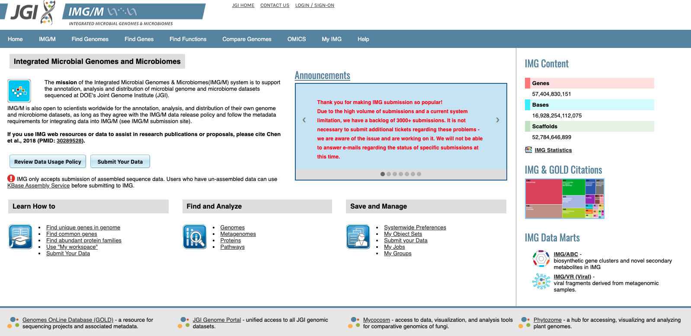
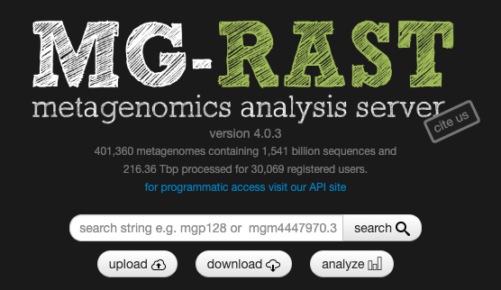
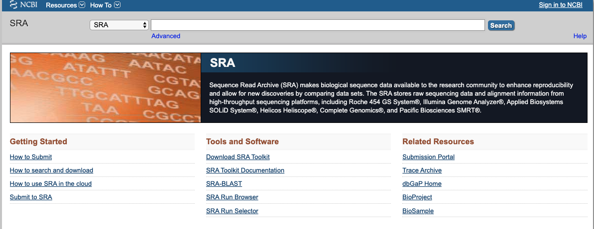

# Metagenomics
## Processing and analysis of shotgun sequencing data

### Useful resorces:

- https://astrobiomike.github.io/genomics/metagen_anvio#anvio-time

- https://github.com/mblstamps/stamps2019/wiki

- https://github.com/metagenome-atlas/atlas

## How to retrieve samples?

#### JGI IMG

#### MG-RAST

#### NCBI SRA db

#### Your own

####

